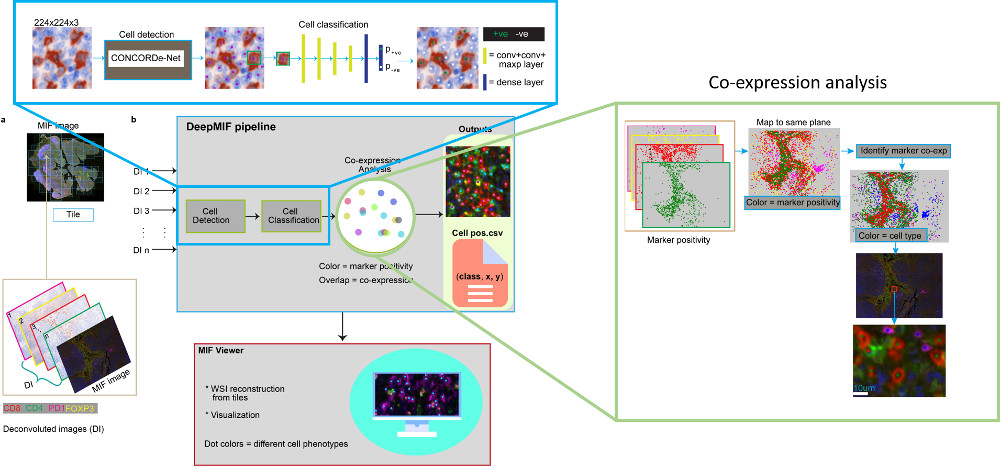
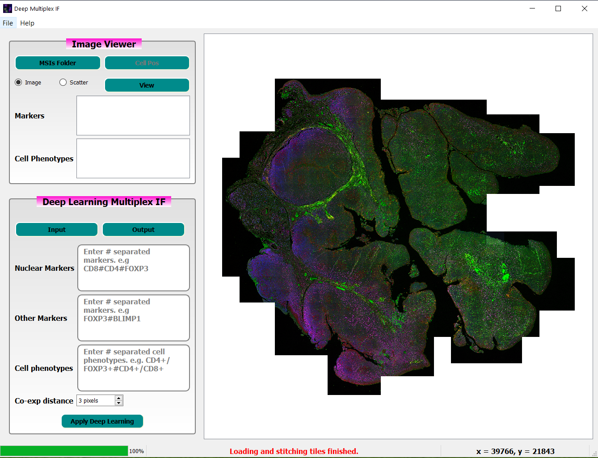
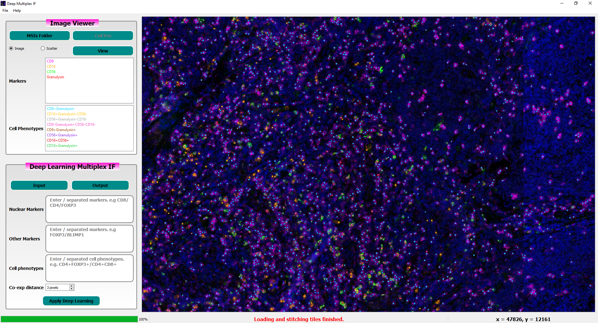

# ***DeepMIF***: Deep learning based cell profiling for multispectral immunofluorescence images with graphical user interface


[***Accepted in Medical Image Computing and Computer-Assisted Intervention (MICCAI) 2022***], which will be held in Singapore from Sep 18-22, 2022. 

Multispectral immunofluorescence (M-IF) analysis is used to investigate the cellular landscape of tissue sections and spatial interaction of cells. However, complex makeup of markers in the images hinders the accurate quantification of cell phenotypes. We developed DeepMIF, a new deep learning (DL) based tool with a graphical user interface (GUI) to detect and quantify cell phenotypes on M-IF images, and visualize whole slide image (WSI) and cell phenotypes. The GUI was developed using PyQt. To identify cell phenotypes, we detected cells on the deconvoluted images followed by co-expression analysis to classify cells expressing single or multiple markers. We trained, tested and validated our model on > 50k expert singlecell annotations from multiple immune panels on 15 samples of follicular lymphoma patients. Our algorithm obtained a cell classification accuracy and area under the curve (AUC) ≥ 0.98 on an independent validation panel. The cell phenotype identification took on average 27.5 minutes per WSI, and rendering of the WSI took on average 0.07 minutes. Deep- MIF is optimized to run on local computers or high-performance clusters independent of the host platform. These suggest that the DeepMIF is an accurate and efficient tool for the analysis and visualization of M-IF images, leading to the identification of novel prognostic cell phenotypes in
tumours.


## Installation
**Download code to your local computer**
```
git clone https://github.com/YemanBrhane/DeepMIF.git
```
**To install in virtual environment**
- Python==3.6
- numpy==1.17.5
- pandas==1.0.5
- scikit-learn==0.22.2
- scikit-image==0.16.2
- scipy==1.4.1
- matplotlib==3.2.2
- opencv-python==4.1.2.30
- seaborn==0.10.1
- PyQt5==5.15.6

or use the requirement.txt

**Using docker image**

Make sure you are in the DeepMIF code directory and type this in terminal:
```
docker build -t ImageName:TAG .  
```
(example: docker build -t deepmif:01 .)


## Input data directory structure
Once the repository has been clone/downloaded, you have to put your dataset in the following structure.
```
.
├── HomeDirectory
│   ├── Case 1
        - 1_[41351,8479]_CD8_path_view.tif
        - 1_[41351,8479]_CD4_path_view.tif
        - 1_[41351,8479]_FOXP3_path_view.tif
        - 1_[41351,8479]_PD1_path_view.tif
        - 1_[41351,8479]_composite_image.tif
                        .
                        .
                        .

│   |── Case 2    
                        .
                        .
                        .                                                                                                              
|   |── Case n
                        .
                        .
                        .
```
### DeepMIF pipeline

The DeepMIF pipeline has four main sections: cell detection, cell classification,
co-expression analysis and WSI viewer (Fig. 1b). The Vectra 3 platform generates
M-IF and DIs corresponding to every protein/marker used in the M-IF
scanning (Fig. 1a). While the DIs have simple features (negative or positive for
a marker), the M-IF image contains complex aggregate features of all markers
used. Thus, we applied DL on the DIs followed by co-expression analysis to find
cells expressing either single or multiple markers on M-IF images.



```
Figure 1| DeepMIF workflow
```
For cell nucleus detection  <a href="https://link.springer.com/chapter/10.1007/978-3-030-32239-7_74"> CONCORDe-Net </a> CONCORDe-Net (Hagos et al. (2019) MICCAI2019 ) was used. 


## Graphical user interface

```
Figure 2| DeepMIF graphical user interface
```



```
Figure 3| Sample annotated image visualization
```

# How to run DeepMIF
The DeepMIF software along with its graphical user interface will be publicly available soon. For now, you can use this command line to run the pipeline:

```
run_deepmif.bat path/to/dockerimage path/to/data output/dir  co-expdist nuclearMarkers nonNuclearMarkers


```

# Citation

Will be updated.
